# Demanda de Transporte

Destacar que este material ha sido elaborado en conjunto con `Sander van Cranenburgh dentro del curso: Discrete Choice Analysis: micro-econometrics and machine learning approaches (TU Delft, 2023, 2024) y Travel Research Behaviour (TU Delft, 2025)`

Su uso es exclusivo para el curso y sus estudiantes. No se permite compartir sin previa autorización.

## Instructions to set up your Python workspace

In this section, we will guide you through the configuration of your Python environment for the Latent Class choice modelling part of the course. You have three options for setting up your environment: Anaconda, PIP or Google Colab. We recommend using Anaconda.

### A. Setting up with Anaconda

Anaconda is a popular platform for managing Python environments. If you’re using Anaconda, it’s recommended to use Python version **3.12.7, 3.11.10, or 3.10.15** to avoid compatibility issues. Other versions, such as **3.9 or  older**, are known to give problems.

Step-by-Step Instructions:

#### Instruction 1: Creating your Python environment in Anaconda
0. **Install Anaconda**: 

   * Go to the [Anaconda download page](https://docs.anaconda.com/anaconda/install/).
   * Choose the appropriate version and click Download.
   * Run the installer and follow the  instructions.

1. **Open Anaconda Navigator**: Go to the “Environments” tab on the left sidebar of the Anaconda Navigator.
   

2. **Create a new environment:** Click on the "Create" button at the bottom of the window.

    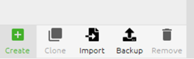
   
3. **Name your environment and choose Python version**: Enter a name for your new environment (e.g., SEN1721) and select Python version 3.12.7 from the drop-down menu.

    
   
4. **Activate the environment:** Go to the “Home” tab in Anaconda Navigator. You should see your newly created environment on the right side. Select it and launch Jupyter Notebook or JupyterLab from here.
 
   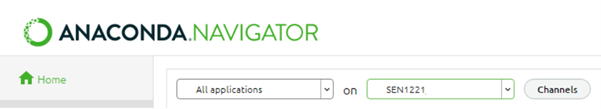

5. **Download and set up the course materials:** Download the SEN1721 course repository from GitHub. Unzip the file into a working directory of your choice. Inside, you’ll find Jupyter notebooks, a requirements.txt file, and datasets.

6. **Launch JupyterNotebook or JupyterLab and find your workspace**: You will see the notebook, the `requirements.txt` file, and the `data` folder.

   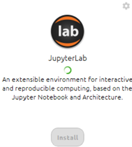
 
   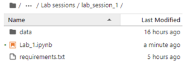
   
7. **Import packages:** Once inside the notebook, locate the requirements.txt file and uncomment the necessary lines in the provided setup code. Run the cells to import all required packages. If some packages fail to install, restart the kernel and rerun the commands.

   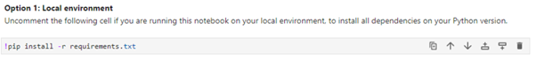

8. **Import all packages:** Run the cells to import all required packages. 
 
   
   
   If some packages fail to install, restart the kernel and repeat steps: 7 and 8
 
   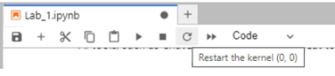

9. **Run the notebook**: Once the setup is complete, you’re ready to run your code. The required packages will be installed, and you can proceed with the in-class assignment.
   
#### Instruction 2: Create environment and install the requirements through the terminal.

If you prefer using the terminal to manage your environment:

1.	Open Anaconda Terminal: Click the green play button next to your environment name in the “Environments” tab to open a terminal.

      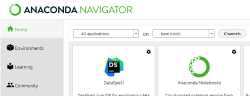

2. **Create a new environment:** Click on the "Create" button at the bottom of the window.

   

3. **Configure the new environment:** Enter a name for your new environment, e.g., "SEN1721," and choose the Python version == “3.12.7" from the drop-down menu.

   

4. **Activate the environment:** Click on the green "Play" button on the right side of the environment name to open a terminal where the environment is activated.

   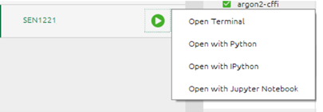

5. **Verify Python version:** You can run `python --version` in the terminal.

   

6. **Navigate to the project folder:** Use the `cd` command to navigate to the project folder, for example, `cd …/…/…/Q2_2024`.

   

7. **Install requirements file:** Now, you can install the `requirements.txt` file within the activated environment using the following command: `pip install -r requirements.txt`

   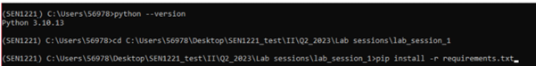
  
8. **Install and launch JupyterNotebook/JupyterLab**

   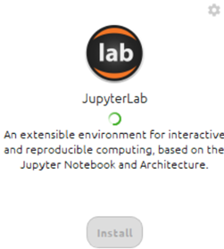
   
9. **Import all packages**

   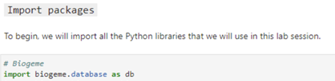

10. **Run the notebook**: Once the setup is complete, you’re ready to run your code. The required packages will be installed, and you can proceed with the in-class assignment.

### B. Setting up with PIP (Python Package Manager)

If you’re not using Anaconda, you can set up your environment using PIP, which is the default package manager for Python.

Step-by-Step Instructions:

1. **Ensure you have Python 3.10 or higher:** Confirm you have Python installed on your system (version 3.10 to 3.12 is recommended). You can check your Python version by running python --version in your terminal. Additionally, ensure you have set up an IPython environment on your computer (Jupyter, VSCode, or any alternatives). 

2. **Clone or download the repository:** Download the course repository from GitHub. Unzip it into a working folder.
3. **Install requirements:**  Now you have two options: (a) Install dependencies separate from your current Python version; (b) Install dependencies for this notebook in your Python version (easy way):
   
    * Option a: (for those familiar with Python environments):
        * Open your terminal and navigate to the course folder.     
        * Create a new "virtual environment" (a separate workspace for this course).
        * Install the required packages listed in the requirements.txt file within this environment.

                         
    * Option b: (easiest way; for people unfamiliar with Python environments):
        * Open the Python notebook you want to work on (Step 1)
        * Uncomment the line related to using a local set-up and run it (see the figure below).
        * Re-comment the lines to avoid re-installing the dependencies every time you run the notebook.
          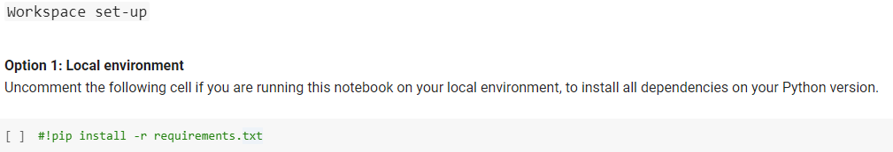

    * Instructions for creating a new virtual environment (if choose option a):
        * Open your command prompt or terminal.
        * Navigate to the directory where you want to create the environment.
        * Type: python -m venv myenv (Replace myenv with a name you choose for your environment).
        * Activate the environment (on Windows, type: myenv\Scripts\activate, on MacOS/Linux, type: source myenv/bin/activate).
        * Install requirements from a File. With your environment activated, navigate to the folder containing the requirements.txt file and run: pip install -r requirements.txt.

4. **Open the notebook**: Launch Jupyther Notebook, JupyterLab, or another IPython tool (e.g., VSCode), and make sure you’re running the notebook inside the newly created virtual environment.

